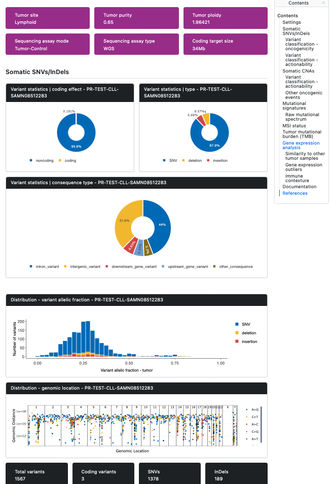

# tamor
Illumina Dragen cancer genome and transcriptome analysis automation using Snakemake, integrating Personal Cancer Genome Report generation on hg38.

# Installation

0. Nota bene: These instructions assume that you already have a Dragen server with software version 3.10 or higher and a working ``hg38`` genome index.

1. Download this code base:

```bash
git clone https://github.com/nodrogluap/tamor
```

2. Install all the dependencies via conda or [mamba](https://mamba.readthedocs.io/en/latest/installation.html) (my preference because it's much, much faster):

```bash
mamba env create -f conda_tamor.yml
```

3. Due to quirks in the conda dependencies spec, you will need to install the latest version of the Perl ``zlib`` library module manually, and the R hg38 genome sequence module:

```bash
cpanm Compress::Raw::Zlib
R -e 'BiocManager::install("rtracklayer", force=TRUE);BiocManager::install("BSgenome.Hsapiens.UCSC.hg38")'
```

4. Download and index the cancer databases that CPSR and PCGR rely on for annotation of your discovered sequence variants:

```bash
BUNDLE=pcgr.databundle.hg38.20220203.tgz
wget http://insilico.hpc.uio.no/pcgr/$BUNDLE
tar zxvf $BUNDLE
```

# Configuration

If you do not have the tamor directory leading in your shell's ``PATH`` variable, you will need to prepend it so tamor's ersatz ``bcftools`` command is used (place this in your .bashrc if you don't want to do this manually each time):

```bash
export PATH=/where/you/have/put/tamor:$PATH
```

Copy the ``config.yml.sample`` file to config.yml:

```bash
cp config.yml.sample config.yml
```

This is the file that you can customize for your site-specific settings. By default the config is set up to write result files under the current directory in ``data/output``, and is expecting the list of paired tumor-normal samples in a file called ``tumor_dna_paired_germline_dna_samples.tsv`` which has 5 columns:

```
subjectID<tab>tumorSampleName<tab>germlineSampleName<tab>TrueOrFalse_germline_data_contain_some_tumor<tab>PCGRTissueSiteNumber
```

The tumorSampleName and germlineSampleName must *CONTAIN NO UNDERSCORES*, and be exact names you used in your Illumina sequencing sample spreadsheet. These sample sheets are the only metadata to which tamor has access. Place all the Illumina experiment sample sheets for your project into ``data/spreadsheets`` by default (see the ``samplesheets_dir`` setting in ``config.yml``). The list of tissue site numbers for the version of PCGR included here is:

```
                        0 = Any
                        1 = Adrenal Gland
                        2 = Ampulla of Vater
                        3 = Biliary Tract
                        4 = Bladder/Urinary Tract
                        5 = Bone
                        6 = Breast
                        7 = Cervix
                        8 = CNS/Brain
                        9 = Colon/Rectum
                        10 = Esophagus/Stomach
                        11 = Eye
                        12 = Head and Neck
                        13 = Kidney
                        14 = Liver
                        15 = Lung
                        16 = Lymphoid
                        17 = Myeloid
                        18 = Ovary/Fallopian Tube
                        19 = Pancreas
                        20 = Peripheral Nervous System
                        21 = Peritoneum
                        22 = Pleura
                        23 = Prostate
                        24 = Skin
                        25 = Soft Tissue
                        26 = Testis
                        27 = Thymus
                        28 = Thyroid
                        29 = Uterus
                        30 = Vulva/Vagina
```

# Running a paired tumor-normal analysis

Any time you want to use tamor, you must be sure to have the conda/mamba environment loaded:

```bash
mamba activate pcgrr
```

Once the sample pairing file mentioned earlier is ready, you can simply run Snakemake to generate the BAMs, VCFs, and CPSR/PCGR reports:
  
```bash
snakemake --cores=1
```
The default outputs are in a directory called ``data/output/sampleID_tumorSampleName_germlineSampleName``. I persoanlly find the most relevant document to be the self-contained Web page ``sampleID.pcgr_acmg.grch38.flexdb.html``.


